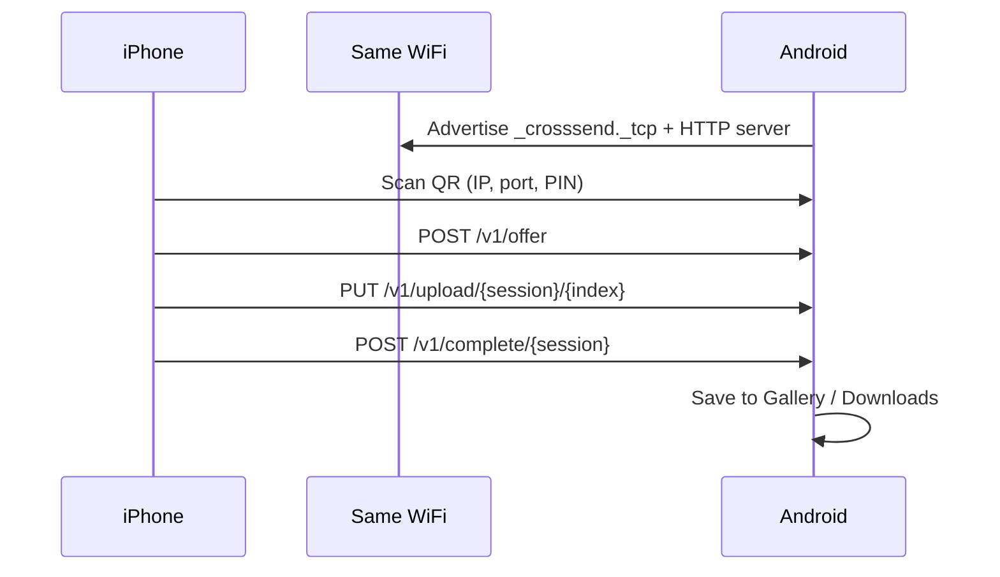

# CrossSend

Cross-platform file transfer: send photos and documents from **iPhone** to **any Android phone** over local Wi‑Fi. No cloud, no account.

## Project layout

```
crosssend/
├── protocol/v1.md      # Shared HTTP transfer protocol
├── android/            # Android receiver app (Kotlin + Compose)
└── ios/                # iPhone sender app (SwiftUI)
```

## How it works

1. Install **CrossSend** on both phones.
2. Connect both devices to the **same Wi‑Fi network**.
3. On Android, tap **Start receiving** — a QR code and 6-digit PIN appear.
4. On iPhone, pick the device under **Nearby devices** (or scan QR), select files, then **Send to Android**.
5. Files are saved to Gallery (photos/videos) or Downloads/CrossSend (documents).



## Android app

### Requirements

- Android Studio Ladybug (2024.2.1) or newer
- JDK 17
- Android SDK 35
- Physical device recommended (emulator networking can be flaky for LAN transfer)

### Build and run

```bash
cd crosssend/android
./gradlew :app:assembleDebug
```

Install the APK from `app/build/outputs/apk/debug/app-debug.apk`, or click **Run** in Android Studio after opening the `crosssend/android` folder.

### Permissions

The app requests notification permission (Android 13+) for the foreground receive service. Cleartext HTTP is enabled for local LAN transfer only.

## iOS app

### Requirements

- macOS with Xcode 16+
- iPhone running iOS 17+
- [XcodeGen](https://github.com/yonaskolb/XcodeGen) (optional but recommended)

### Generate Xcode project

```bash
cd crosssend/ios
brew install xcodegen   # if needed
xcodegen generate
open CrossSend.xcodeproj
```

Without XcodeGen, create a new iOS App project in Xcode and add all files under `CrossSend/`.

### Build and run

1. Open `CrossSend.xcodeproj` in Xcode.
2. Select your iPhone as the run destination.
3. Set your development team under Signing & Capabilities.
4. Run (⌘R).

### Permissions

- **Local Network** — discover Android devices on Wi‑Fi
- **Camera** — scan pairing QR code
- **Photo Library** — pick photos and videos to send

## Protocol

See [protocol/v1.md](protocol/v1.md) for the full HTTP API (`/v1/info`, `/v1/offer`, `/v1/upload`, `/v1/complete`).

Pairing QR format:

```
crosssend://v1?h=<ipv4>&p=53317&pin=<6-digit>&n=<device-name>
```

## MVP status

| Feature | Status |
|---------|--------|
| Android receive mode + QR | Done |
| Android HTTP server + file save | Done |
| iOS QR scan + file pick | Done |
| iOS → Android transfer | Done |
| mDNS auto-discovery (browse list) | Done |
| Resume interrupted transfers | Planned |
| TLS encryption | Planned |
| Android → iPhone | Planned |

## Troubleshooting

| Issue | Fix |
|-------|-----|
| iPhone can't connect | Confirm same Wi‑Fi; rescan QR; check router client isolation |
| PIN rejected | Stop and restart receive mode on Android for a new PIN |
| Large files fail | Keep both apps in the foreground during transfer |
| Photos not in Gallery | Check Pictures/CrossSend or Downloads/CrossSend |

## License

MIT — see repository [LICENSE](../LICENSE).
